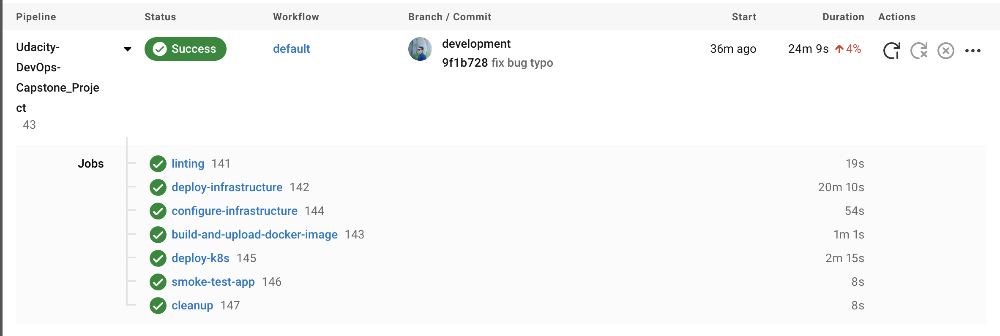

# Udacity-DevOps-Capstone_Project

The final project of the Cloud DevOps Engineer

## General info

The Application is based on a python3 script using <a target="_blank" href="https://flask.palletsprojects.com">flask</a> to render a simple webpage in the user's browser.
A requirements.txt is used to ensure that all needed dependencies come along with the Application.

## Tools

Project is created with:

- CirleCI
- CloudFormation
- AWS - EKS
- Kubernetes
- Docker Hub
- GitHub
- Ansible

## Folder structure

- src : Source Files
- .circleci : Configuration CircleCI Pipeline file
- cloudformation: contains Cloudformation IaC files that helps to create infra on AWS
- ansible: contains ansible config file to connect to EC2 on AWS and set up the app on EKS cluster
- screenshots: contains all screenshot files for submission

## Linting using Pylint and Hadolint

Linting is used to check if the Application and Dockerfile is syntactically correct.
This process makes sure that the code quality is always as good as possible.

## DockerHub

I used Dockerhub to store my app's image

## Kubernetes Cluster

I used AWS CloudFormation to create Infrastructure needed for the application
The CloudFormation Deployment can be broken down into four Parts:

- **Networking**, to ensure all about the network for the cluster
- **Elastic Kubernetes Service (EKS)** is used to create a Kubernetes Cluster
- **NodeGroup**, each NodeGroup has a set of rules to define how instances are operated and created for the EKS-Cluster
- **Agency** is needed to configure and manage the Cluster and its deployments and services.

## CircleCi - CI/CD Pipelines

I used CircleCi to create a CI/CD Pipeline to deployed application automatically to the Cluster using Ansible and Cloudformation.

## Usage

To run this project in CircleCI, you have to:

- Setup and Configure CirceCI account with Github and AWS Credentials
- Setup DockerHub account.
- AWS : create an IAM user and a ssh pem key then store in your local
- Configure enviroment variables AWS_DEAFULT_REGION, AWS_ACCESS_KEY_ID, AWS_SECRET_ACCESS_KEY, DOCKERHUB_PASSWORD, DOCKERHUB_USERNAME in your CircleCI account
- Configure ssh key with the ssh pem key above to help circleci (ansible) can connect to your AWS ec2
- Change the build job from config.yml in order to include your DockerHub credentials, for example :

```
docker build -t anhleduc1208/hello-world-py:latest .
docker tag hello-world-py:latest $DOCKERHUB_USERNAME/hello-world-py:${CIRCLE_WORKFLOW_ID:0:7}
docker push $DOCKERHUB_USERNAME/hello-world-py:${CIRCLE_WORKFLOW_ID:0:7}

```

## Result

Pipeline failed by the Linting
(./screenshots/lint_fail.png)

Pipeline success with lint job
(./screenshots/lint_success.png)

Lists of EC2
(./screenshots/list_ec2.png)

Dockerhub Repo
(./screenshots/docker_hub.png)

EKS service and deployment after ci/cd pipeline finish
(./screenshots/k8s_info.png)

ELB Dns
(./screenshots/success_app.png)

Success CI-CD pipeline


Public LoadBalancer DNS: http://aacf98e493aa043fc96d7c1b44b53fc0-1931962586.us-east-1.elb.amazonaws.com/
